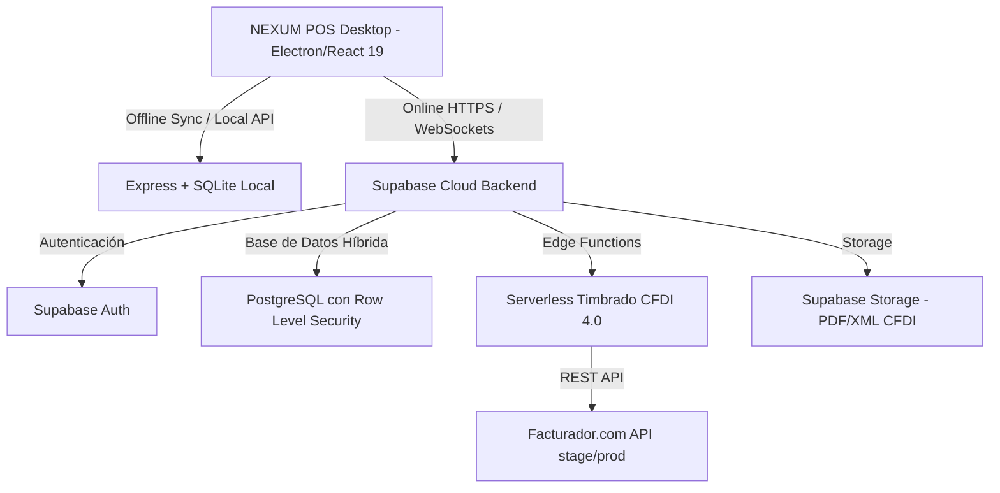

# 🛒 Documento de Requisitos de Producto (PRD) - NEXUM POS

## 1. Información General y Objetivos
- **Nombre del Producto:** NEXUM POS (Sistema de Ventas POS - SaaS)
- **Versión del Documento:** 1.3.0
- **Fecha de Actualización:** Junio 2026
- **Autor/Equipo:** FoxSolid23df-IA / Equipo de Desarrollo

### 1.1 Declaración del Problema
Los pequeños y medianos negocios requieren un sistema de punto de venta (POS) que sea extremadamente rápido, confiable y que garantice la continuidad operativa. La dependencia total de la conexión a internet es un riesgo crítico para las ventas diarias, mientras que la falta de herramientas integradas de control de inventario complejo (como la venta mixta en cajas y piezas), auditoría de caja (prevención de robos hormiga) y facturación electrónica CFDI 4.0 alenta el flujo de trabajo del negocio.

### 1.2 Visión del Producto
NEXUM POS es una solución híbrida premium de Punto de Venta (POS) multi-tienda (SaaS) con capacidades offline-first para Windows (mediante Electron) y web (React + Supabase). Su objetivo es proporcionar una interfaz de usuario visualmente impresionante, operaciones a milisegundos con soporte para hardware especializado (escáneres de códigos de barras, ticketera térmica), control estricto de inventarios de cajas/piezas, arqueos ciegos para auditoría de caja, facturación electrónica integrada CFDI 4.0 y licenciamiento controlado por suscripción.

---

## 2. Arquitectura del Sistema
El sistema utiliza una arquitectura híbrida de tres capas diseñada para garantizar alta disponibilidad y tolerancia a fallos de red.

### 2.1 Tecnologías y Componentes Clave
- **Frontend SPA:** React 19.1.1, Vite 7.1.1, React Router 7.8.0, SweetAlert2 para modales interactivos y React Icons para iconografía.
- **Capacidades de Escritorio:** Electron (proceso principal en [electron-main.js](file:///c:/POS/electron-main.js) y precarga en [preload.js](file:///c:/POS/preload.js)), empaquetador NSIS a través de `electron-builder` para generar ejecutables autocontenidos sin prerrequisitos de instalación (ej. Node.js).
- **Backend Local (Offline):** Express.js ejecutando un servidor local en el puerto 3001, con almacenamiento persistente en SQLite local (`sistema-pos.db` en `%APPDATA%`).
- **Backend en la Nube (Online / Multi-tenant SaaS):** Supabase Cloud.
  - **Base de Datos:** PostgreSQL con Row Level Security (RLS) activo para asegurar el total aislamiento de datos entre tiendas.
  - **Seguridad:** Aislamiento multi-tenant. Cada transacción, producto y venta incluye un identificador `user_id` vinculado al propietario de la tienda.
  - **Supabase Edge Functions:** Manejo seguro de llamadas externas y tokens de Facturador.com para timbrado de facturas CFDI 4.0.

---

## 3. Requisitos Funcionales y Módulos del Sistema

### 3.1 Módulo del Punto de Venta (POS)
Este es el núcleo operativo de la aplicación. Su diseño debe ser extremadamente rápido y optimizado para teclado y lector de códigos de barras.
- **Multi-Caja:** Soporte para múltiples terminales de cobro operando en la misma sucursal de manera simultánea.
- **Pantalla del Cliente:** Soporte para una interfaz secundaria opcional donde el cliente puede visualizar en tiempo real los artículos escaneados, precios, subtotal y total de su compra.
- **Escaneo Inteligente:** Soporte para lectores de códigos de barras en modo HID (emulación de teclado) y serial/Bluetooth (ver [ESCANNER_BT_ACTUALIZACION.md](file:///c:/POS/ESCANNER_BT_ACTUALIZACION.md)). El foco siempre debe regresar al input de venta de manera automática.
- **Persistencia de Carrito:** La compra en proceso se almacena en el estado persistente del dispositivo (LocalStorage/IndexedDB) para que no se pierda si se recarga el navegador o la app por accidente.
- **Búsqueda por Nombre:** Input inteligente con autocompletado y búsqueda difusa (Fuzzy Search) que muestra coincidencias del inventario en milisegundos.
- **Tickets Personalizados:** Renderizado y formateo de tickets mediante [ticketFormatter.js](file:///c:/POS/frontend/src/utils/ticketFormatter.js) para impresoras térmicas (58mm u 80mm).
  - Configuración desde [TicketConfig.jsx](file:///c:/POS/frontend/src/components/config/TicketConfig.jsx) que incluye: Logotipo de la tienda, datos de contacto, encabezado y pie de página personalizados, tamaño de letra, formato de IVA y control de impresión automática al finalizar.

### 3.2 Gestión de Inventario, Cajas y Piezas
Soporta un flujo comercial flexible que permite vender productos de forma individual o en empaques cerrados (cajas o paquetes).
- **Variables de Producto para Empaque:**
  - `box_units`: Cantidad de piezas individuales que integran una caja (ej. 12, 24, 30 unidades).
  - `box_price`: Precio especial y diferenciado al vender la caja completa.
  - `box_barcode`: Código de barras específico asignado a la caja física (diferente al de la pieza).
- **Conversión Dinámica en Carrito (F2/F3/F4):**
  - **F2:** Toggle rápido para cambiar la unidad de venta del ítem seleccionado (de `PZA` a `CAJA` y viceversa).
  - **F3:** Permite realizar empaque "al vuelo" solicitando la cantidad de piezas deseadas y asignando un precio sugerido proporcional.
  - **F4 (Bulk Pack):** Empaqueta todos los productos cargados actualmente en el carrito de compras bajo un solo "Paquete Custom" promocional con precio total editable.
- **Validación Única de Stock:**
  - El stock se almacena unificado en "piezas base" para evitar discrepancias.
  - Al vender una caja de $N$ piezas, el sistema descuenta $N$ piezas del stock global de forma automática.
  - RPC en Supabase (`validate_sale_stock`) valida la disponibilidad total de todos los artículos previo a procesar el cobro.
- **Importación Masiva:** Carga masiva de inventario a través de archivos Excel con validación de tipos de datos.

### 3.3 Auditoría de Caja y Cortes de Turno (Cash Cuts)
- **Control de Turnos:** Cada cajero debe abrir su turno especificando un monto de efectivo inicial (fondo de caja).
- **Arqueo Ciego:** Al realizar el cierre de turno (`corte de caja`), el cajero no ve el monto acumulado calculado por el sistema. Debe contar físicamente el dinero en caja e ingresar el total.
- **Cálculo de Diferencias:** El sistema genera un registro que detalla el dinero esperado vs el dinero real ingresado por el cajero, calculando automáticamente faltantes o sobrantes y notificando al Administrador.
- **Corte de Caja Diario:** Reporte consolidado que agrupa las transacciones de todas las cajas en un rango de 24 horas.

### 3.4 Integración de Facturación Electrónica CFDI 4.0 (México)
Permite emitir facturas legales CFDI 4.0 directamente desde el POS a través de la API REST de **Facturador.com** (ver [Integración de API Facturador.com (Facturación Electrónica CFDI 4.0).md](file:///c:/POS/Integración%20de%20API%20Facturador.com%20(Facturación%20Electrónica%20CFDI%204.0).md)).
- **Protección de Credenciales:** Toda la comunicación con Facturador.com se realiza mediante *Supabase Edge Functions* para evitar la exposición de tokens OAuth (Access Tokens y Refresh Tokens), Client ID, Client Secret y la contraseña del Emisor.
- **Helper de Sesión Continua:** El token dura 1 hora. La Edge Function realiza automáticamente el refresco del token usando el `refresh_token` guardado de forma segura y actualiza los registros en base de datos.
- **Módulo de Clientes (CRUD):** Registro de RFC, Razón Social, Uso de CFDI, CP y Régimen Fiscal en el panel administrativo.
- **Timbrado de Ticket:** Opción en el historial de ventas para timbrar una venta en particular.
- **Almacenamiento y Descarga:** El PDF y XML de la factura devueltos por la API se guardan en un bucket privado de *Supabase Storage*, vinculándolos a la tabla `invoices` para su visualización y descarga directa en el POS.

### 3.5 Control de Licenciamiento y Activación
El sistema cuenta con un esquema de protección por licencias temporales.
- **Expiración Automatizada:** La tabla `invitation_codes` almacena el código de licencia, el UUID del usuario propietario (`used_by`) y la fecha máxima de vigencia (`expires_at`).
- **Pantalla de Licencia Expirada:** Al iniciar la app, se valida que `expires_at > now()`. Si la fecha ha expirado, el sistema bloquea inmediatamente la interfaz, impidiendo realizar ventas o modificar inventarios.
- **Procedimiento de Renovación (Soporte):** Se realiza directamente sobre la base de datos de Supabase actualizando el intervalo de tiempo contratado (ver [ACTIVAR_LICENCIAS.md](file:///c:/POS/ACTIVAR_LICENCIAS.md)).

### 3.6 Herramientas de Mantenimiento y Soporte (Oculto)
- **Ruta Oculta:** Acceso exclusivo a través del hash URL `#/nexumpos-soporte` (ver [ACCESO_SOPORTE_CONFIDENCIAL.md](file:///c:/POS/ACCESO_SOPORTE_CONFIDENCIAL.md)).
- **PIN Maestro:** La pantalla de soporte requiere el código de acceso maestro `2026SOP`.
- **Acciones Críticas de Mantenimiento:**
  - Reset de inventarios conservando la configuración de la tienda.
  - Limpieza y purga de logs forenses históricos.
  - Diagnóstico rápido de conexión con la API de facturación y el estado de la base de datos local SQLite.

---

## 4. Esquema de Base de Datos Híbrida (Modelos de Datos)
El esquema se encuentra definido en SQL. A continuación se presentan las entidades principales:

### 4.1 `profiles` (Usuarios Principales de la Tienda)
- `id` (uuid, PK, ref auth.users): Identificador único del dueño del negocio.
- `store_name` (text): Nombre del negocio / establecimiento.
- `full_name` (text): Nombre completo del propietario.
- `role` (text): Rol general (Propietario / Admin).
- **Campos de API Facturador.com:** `emisor_rfc`, `emisor_id_facturador`, `facturador_api_user`, `facturador_api_pass_md5`, `facturador_client_id`, `facturador_client_secret`, `facturador_refresh_token`.

### 4.2 `products` (Catálogo de Inventario)
- `id` (bigint, PK): Identificador secuencial.
- `user_id` (uuid, FK ref profiles): Dueño del producto (aislamiento SaaS).
- `name` (text): Nombre comercial del artículo.
- `barcode` (text, Unique): Código de barras principal de la pieza.
- `price` (numeric): Precio unitario por pieza.
- `stock` (integer): Cantidad de piezas individuales disponibles.
- `image_url` (text): Enlace a la imagen del producto.
- **Campos de Empaque:**
  - `box_units` (integer): Cantidad de piezas por caja (ej. 12).
  - `box_price` (numeric): Precio de la caja completa.
  - `box_barcode` (text, Unique): Código de barras de la caja física.

### 4.3 `sales` y `sale_items` (Registro de Venta y Detalle)
**`sales`:**
- `id` (bigint, PK): ID único de la venta.
- `user_id` (uuid, FK): Tienda que generó la venta.
- `total` (numeric): Monto total cobrado.
- `created_at` (timestamp): Fecha y hora.

**`sale_items`:**
- `id` (bigint, PK).
- `sale_id` (bigint, FK ref sales).
- `user_id` (uuid, FK).
- `product_name` (text).
- `quantity` (integer): Cantidad de unidades vendidas.
- `price` (numeric): Precio cobrado por unidad.
- `unit_sold` (text): Unidad de cobro (`PZA` o `CAJA`).
- `conversion_factor` (integer): Factor multiplicador (piezas por unidad).
- `base_quantity` (numeric): Total de piezas cobradas (`quantity * conversion_factor`).

### 4.4 `staff` (Personal de Cajas)
- `id` (bigint, PK).
- `user_id` (uuid, FK).
- `name` (text): Nombre del cajero/gerente.
- `role` (text): Rol granular (`Cajero`, `Gerente`, `Admin`).
- `pin` (text): Código de seguridad numérico para inicio rápido y desbloqueo de pantalla.
- `active` (boolean): Estatus de empleo.

### 4.5 `cash_cuts` (Historial de Cortes de Caja)
- `id` (bigint, PK).
- `user_id` (uuid, FK).
- `staff_name` (text): Nombre del empleado que realiza el corte.
- `sales_count` (integer): Cantidad de transacciones.
- `expected_cash` (numeric): Suma teórica de efectivo calculado.
- `actual_cash` (numeric): Dinero en efectivo reportado físicamente.
- `difference` (numeric): Desviación (`actual_cash - expected_cash`).
- `notes` (text): Observaciones o comentarios del cierre.

### 4.6 `clients` (Clientes Fiscales)
- `id` (bigint, PK).
- `rfc` (text, Unique): Registro Federal de Contribuyentes.
- `razon_social` (text): Nombre legal.
- `uso_cfdi` (text): Código de uso de factura SAT.
- `regimen_fiscal` (text): Código de régimen del SAT.
- `codigo_postal` (text): Domicilio fiscal del receptor.
- `email` (text): Envío automático de factura.

### 4.7 `invoices` (Facturas Emitidas)
- `id` (bigint, PK).
- `sale_id` (bigint, FK ref sales).
- `uuid_cfdi` (text): Folio fiscal devuelto por el SAT.
- `pdf_url` (text): Enlace de descarga del ticket PDF timbrado.
- `xml_url` (text): Enlace de descarga del XML de la factura.
- `status` (text): Estado (`Emitida`, `Cancelada`).

---

## 5. Requisitos No Funcionales

### 5.1 Seguridad y Privacidad
- **Row Level Security (RLS):** Cada tabla de Supabase debe tener activada la política RLS con la regla `auth.uid() = user_id` para garantizar que ninguna tienda pueda leer, escribir o modificar datos de otra tienda.
- **Cifrado de Credenciales:** Los tokens y passwords MD5 para Facturador.com deben ser cifrados antes de guardarse en la tabla `profiles`.
- **PINes de Seguridad:** Los PINes de los empleados deben estar encriptados o protegidos con hashes seguros.

### 5.2 Usabilidad y Rendimiento
- **Teclas de Acceso Rápido:** Obligatoriedad de shortcuts configurados para agilizar el cobro y evitar el uso exclusivo de mouse/trackpad:
  - `F2`: Cambiar unidad de venta.
  - `F3`: Ventas de empaques sobre la marcha.
  - `F4`: Empaquetar todo el carrito en "Bulk Pack".
  - `Enter`: Procesar y finalizar venta.
- **Búsqueda Dinámica:** Las consultas en el frontend de productos deben responder en menos de 100 ms sobre un catálogo de hasta 10,000 artículos indexados.
- **Dark Mode Integrado:** Toda la interfaz debe ser adaptable y visualmente consistente en modo oscuro (Dark Mode) y modo claro (Light Mode) sin problemas de visibilidad de textos en inputs y tablas (ver [FILTROS_DARK_MODE_FIX.md](file:///c:/POS/FILTROS_DARK_MODE_FIX.md)).

### 5.3 Disponibilidad Híbrida (Offline-First)
- **Persistencia SQLite:** La base de datos SQLite del cliente de escritorio debe sincronizar los catálogos en momentos de conexión estable y permitir transacciones de venta completas sin internet.
- **Cola de Sincronización:** Las ventas offline se colocan en una pila local y se envían a Supabase de manera secuencial tan pronto como se detecte la restauración del enlace de red.

---

## 6. Criterios de Aceptación y Pruebas
1. **Multi-tienda Aislada (Multi-tenant):** Loggearse en dos cuentas de tiendas diferentes y comprobar que es imposible visualizar los productos o las ventas de la otra tienda.
2. **Ciclo de Caja y Piezas:** Escanear el código de una caja (`box_barcode`), corroborar que se agregue el ítem al carrito marcando la unidad `CAJA` y el precio `box_price`. Al finalizar, verificar en el inventario que el stock se haya reducido por la cantidad exacta de piezas equivalentes (`box_units` * `quantity`).
3. **Corte Arqueo Ciego:** Iniciar un turno con $100. Registrar una venta de $150 en efectivo. Realizar el corte e introducir que físicamente se contaron $240. Comprobar que el reporte final registre una diferencia en caja de -$10 y que el cajero no haya tenido acceso a la cifra esperada ($250) antes de su declaración.
4. **Emisión CFDI 4.0:** Crear una venta de prueba, pulsar el botón de facturar, rellenar los datos de cliente demo de pruebas RFC `GOYA780416GM0` y confirmar la emisión exitosa que descargue el XML y PDF de pruebas.
5. **Detección de Expiración:** Modificar la fecha de expiración del código en Supabase a una fecha pasada. Reiniciar la aplicación y confirmar que la pantalla de bloqueo de licencia bloquee la operación general del POS.
